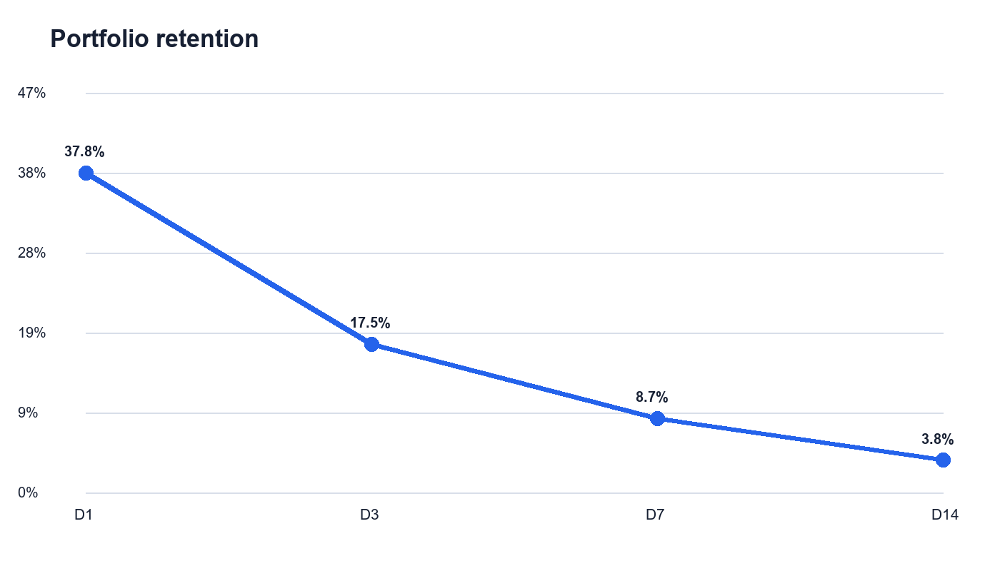
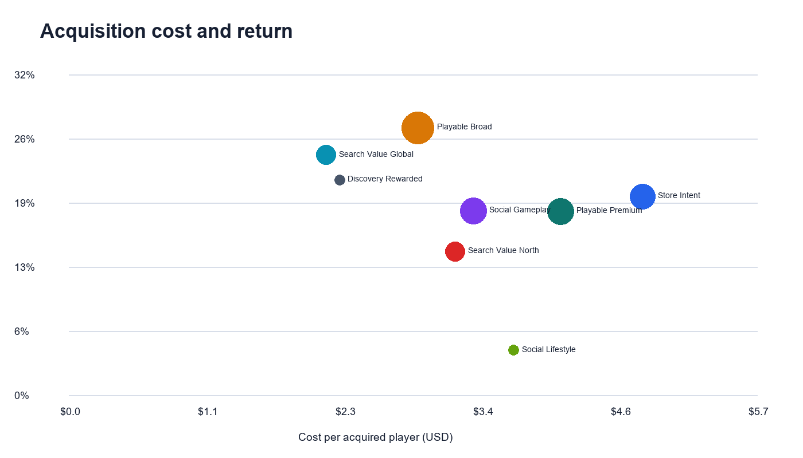

# Mobile Game Marketing Analytics Portfolio

An end-to-end portfolio project that connects fictional paid-acquisition data with synthetic player events to evaluate campaign cost, player quality, retention, engagement and monetization.

> **Privacy note:** Every company name, campaign, creative, identifier, event record, financial value and finding in this repository is synthetic. No employer or client data is included.

## Daily refresh (from October 2025)

From October 2025 the repository is refreshed every weekday. A private production pipeline produces **pattern-only synthetic data**: it keeps the general shape of a live marketing dataset (campaign mix over time, retention decay, engagement, weekday rhythm) while volumes, costs, revenue and retention levels are rescaled by undisclosed factors, noise is added, all names are fictional, dates are moved to a demonstration period and no real identifier is copied. The repository's own pipeline then rebuilds the analysis and charts. [`data/synthetic/live_status.json`](data/synthetic/live_status.json) shows the latest demonstration date. A month's Word report is added once its first cohort reaches Day 7.

## What this project demonstrates

- Deterministic synthetic data generation for two monthly cohorts
- Campaign-to-player identity matching
- Data cleaning, reconciliation and automated validation
- D1, D3, D7 and D14 mature-cohort retention
- CPI, CTR, CVR, retained-user cost and ROAS
- Session, active-day, level and ad-engagement analysis
- Campaign lifecycle and creative-quality comparison
- Management-ready Word reports, Excel dashboards and charts
- Weekly creative review: 14-day creative quality, a 7-day new-creative cost test based on first impressions, and traffic quality (tracking coverage and likely-fraud share by network)

## Repository structure

```text
data/synthetic/          Generated fictional campaign, creative, player and event data
src/                     Data generation, cleaning, analysis, chart and report scripts
outputs/analysis/        Clean data, campaign summaries and validation results
outputs/weekly/          Weekly creative quality, new-creative test and traffic-quality tables
outputs/charts/          Portfolio-ready PNG charts
outputs/dashboards/      August and September Excel dashboards
outputs/reports/         August and September management reports
tests/                   Automated pipeline checks
docs/                    Methodology, data dictionary and privacy design
run_pipeline.py          Rebuilds data, analysis, charts and Word reports
```

## Quick start

```bash
python -m venv .venv
# Windows: .venv\Scripts\activate
# macOS/Linux: source .venv/bin/activate
pip install -r requirements.txt
python run_pipeline.py
python -m unittest discover -s tests
```

The committed Excel files are curated dashboard artifacts. The Python pipeline reproduces the synthetic CSV analysis, charts and Word reports.

## Sample output





## Analytical flow

```text
Synthetic media delivery ─┐
Synthetic creative data ──┼─> cleaning and validation ─> identity join ─> player metrics
Synthetic player/events ──┘                                      │
                                                                 └─> campaigns, creatives,
                                                                     dashboards and reports
```

## Main metric definitions

- **CPI:** spend divided by acquired players.
- **CTR:** clicks divided by impressions.
- **CVR:** reported installs divided by clicks.
- **Retention:** players with a session on the exact return day divided by players mature enough to reach that day.
- **ROAS:** synthetic ad revenue plus synthetic purchase revenue divided by synthetic spend.
- **Cost per D7 retained player:** spend divided by players returning on Day 7.

## Portfolio discussion points

The weekly review adds an operating view. It shows which creatives are genuinely new this week, keeps decisions until a creative has a full week of delivery, and shows how much of each network's traffic actually reaches in-game tracking. Low tracking coverage on one network is a traffic-quality warning that cost metrics alone would hide.

The project shows how acquisition efficiency can differ from downstream player quality. A low-cost campaign may produce weak retention, while a higher-cost campaign may create more valuable players. The reporting layer therefore combines acquisition, engagement, retention and monetization rather than ranking campaigns by installs alone.

See [docs/METHODOLOGY.md](docs/METHODOLOGY.md) for the complete workflow and [docs/PRIVACY.md](docs/PRIVACY.md) for the safeguards used.

## License

MIT. The dataset is fictional and may be reused for learning and portfolio demonstrations.
